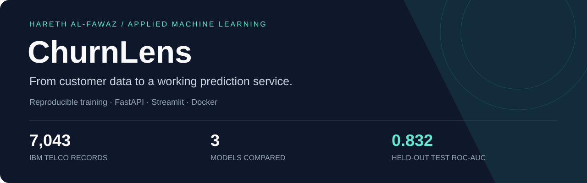
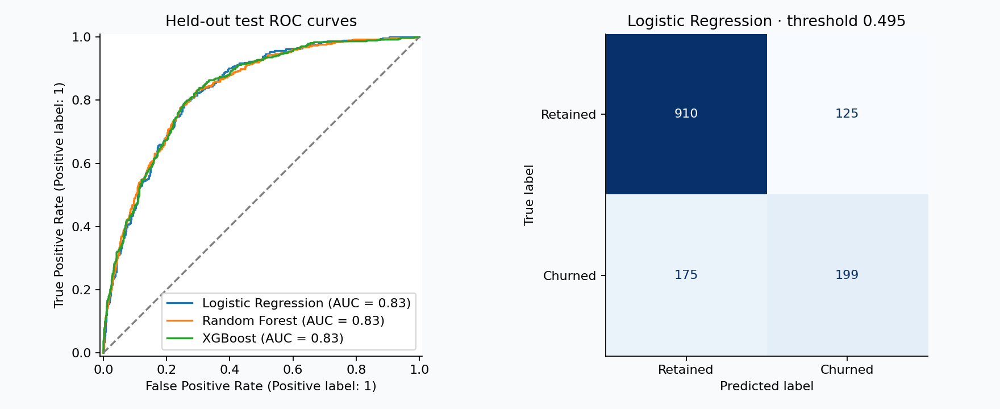
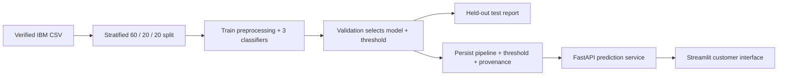

<p align="center"></p>

<p align="center">
  <a href="https://github.com/The7areth/churnlens/actions/workflows/ci.yml"></a>
  
  <a href="LICENSE"></a>
</p>

**Which customers should a retention team review first?** ChurnLens explores that question using IBM's fictional telecom sample, then turns the selected model into a working API and interactive application.

**Built by [Hareth Al-Fawaz](https://github.com/The7areth).** Python · Pandas · scikit-learn · XGBoost · FastAPI · Streamlit · Docker.

[Understand the project](docs/project-walkthrough.md) · [Run locally](docs/running-locally.md) · [Review the results](reports/comparison.md) · [Interview preparation](docs/interview-guide.md) · [Model card](docs/model-card.md)

## What this demonstrates

- A reproducible path from validated CSV data to an interactive prediction.
- Training-only preprocessing inside a persisted scikit-learn pipeline.
- Logistic Regression, Random Forest, and XGBoost compared under the same split.
- Model selection and threshold tuning on validation data; final evaluation on a held-out test set.
- Typed API inputs, service-consistency checks, readiness handling, and shared inference logic.
- Automated tests, CI, Docker configuration, and documented limitations.

## Results you can inspect

**7,043 customers → 4,225 training / 1,409 validation / 1,409 test.** Stratified split, seed 42. The churn rate is about 26.5%.

| Model | Validation ROC-AUC | Test ROC-AUC | Test precision | Test recall | Test F1 |
|---|---:|---:|---:|---:|---:|
| **Logistic Regression** | **0.860** | 0.832 | 0.619 | 0.527 | 0.569 |
| Random Forest | 0.857 | 0.831 | 0.641 | 0.468 | 0.541 |
| XGBoost | 0.857 | 0.832 | 0.622 | 0.471 | 0.536 |

All comparison rows use threshold **0.5**. Logistic Regression was selected by **validation ROC-AUC**; the small differences do not establish statistical superiority.

The served model uses a **0.495 threshold**, selected by validation F1. On the test set it achieves **61.4% precision, 53.2% recall, and 0.570 F1**. It finds **199 of 374 churners**, with **125 false positives**. These numbers make the operating tradeoff visible; ROC-AUC is not accuracy.



[Full metrics and versions](reports/metrics.json) · [Business interpretation](reports/business-interpretation.md) · [Verification record](reports/verification.md)

## Try it locally

Use **Python 3.12**. On macOS, XGBoost may need OpenMP (`brew install libomp` if you use Homebrew); otherwise the pipeline records a two-model fallback.

```bash
git clone https://github.com/The7areth/churnlens.git
cd churnlens
python3 -m venv .venv
source .venv/bin/activate
# Windows PowerShell: .venv\Scripts\Activate.ps1
python -m pip install -r requirements-dev.txt
python -m pip install --no-deps -e .
python -m churn.data
python -m churn.train
pytest -q
```

Start the API:

```bash
uvicorn churn.api:app --host 127.0.0.1 --port 8000
```

In a second terminal, activate the environment and start the UI:

```bash
streamlit run app/streamlit_app.py
```

Open **http://localhost:8501** for the application and **http://localhost:8000/docs** for interactive API documentation. Enter a customer, select **Estimate churn risk**, and inspect the probability, risk band, and threshold.

For Docker, Windows, offline smoke tests, and troubleshooting, see [running locally](docs/running-locally.md). The full dataset and model are generated locally and ignored by Git. The included synthetic sample supports offline smoke tests; its metrics are not benchmark evidence.

## Architecture



**Training:** convert blank TotalCharges to missing values, learn numeric medians and scaling on training data, one-hot encode categories, and fit each classifier. Customer ID and the target are excluded from inputs.

**Serving:** validate the customer, apply the persisted transformations, obtain a churn probability, and compare it with the saved threshold. No model fitting occurs during an API request.

## Navigate the code

| Area | Entry point | Responsibility |
|---|---|---|
| Dataset | [data.py](src/churn/data.py) | Download retries, SHA-256 verification, schema and ID checks |
| Preprocessing | [pipeline.py](src/churn/pipeline.py) | Imputation, scaling, one-hot encoding |
| Training | [train.py](src/churn/train.py) | Split, fit, select, evaluate, persist |
| Exploration | [eda.py](src/churn/eda.py) | Training-only summaries and plots |
| Contract | [schema.py](src/churn/schema.py) | Categories, bounds, missing values, service consistency |
| Inference | [predict.py](src/churn/predict.py) | Load the trusted artifact and produce predictions |
| API | [api.py](src/churn/api.py) | `/health`, `/predict`, startup readiness |
| UI | [streamlit_app.py](app/streamlit_app.py) | Customer form, API calls, model evidence |
| Verification | [tests](tests) | Pipeline, persistence, API, downloader, and UI integration |

## API example

```bash
curl -X POST http://localhost:8000/predict \
  -H 'Content-Type: application/json' \
  --data-binary @examples/customer.json
```

The response contains `churn_probability`, `risk`, `predicted_churn`, `threshold`, `model`, and `dataset`. `TotalCharges` may be null; invalid categories or contradictory services return 422. A missing model returns 503. See the [complete input example](examples/customer.json).

## What to know before interpreting the scores

This is a **portfolio benchmark on fictional sample data**. It has not established a future churn horizon, production accuracy, calibrated probabilities, or measured retention lift. F1 is a demo threshold objective; a business would choose an operating point using costs and outreach capacity. Feature importance describes associations rather than causal effects.

The model card documents data limitations, demographic inputs, extrapolation, and deployment boundaries. The [walkthrough](docs/project-walkthrough.md) explains the decisions and tradeoffs in detail; the [interview guide](docs/interview-guide.md) includes challenging questions and grounded answers.

## Reproduce, contribute, extend

```bash
pytest -q
black --check src app tests
```

CI checks formatting, tests, a synthetic three-model training run, and the Docker application. See the **live CI badge** for execution status; [verification notes](reports/verification.md) describe local checks. Direct dependencies are pinned, and `requirements-lock.txt` captures the tested Python 3.12 development environment. Platform differences can affect numerical results.

See [CONTRIBUTING.md](CONTRIBUTING.md) for the development workflow and [the roadmap](docs/roadmap.md) for prioritized extensions. [The demo guide](docs/demo-guide.md) includes a short presentation and a CV bullet.

## License and attribution

Project code: [MIT](LICENSE). Dataset: [IBM Telco Customer Churn](https://github.com/IBM/telco-customer-churn-on-icp4d), with the upstream [Apache-2.0 license retained](data/IBM-LICENSE.txt). See [data provenance](data/README.md). The 180-row sample is independently generated synthetic test data.

Implementation references: [scikit-learn pipelines and leakage](https://scikit-learn.org/stable/common_pitfalls.html), [FastAPI request bodies](https://fastapi.tiangolo.com/tutorial/body/), and [Streamlit forms](https://docs.streamlit.io/develop/api-reference/execution-flow/st.form).
